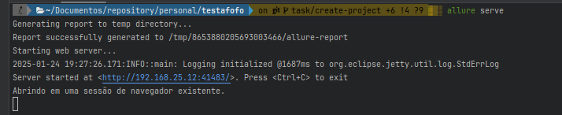
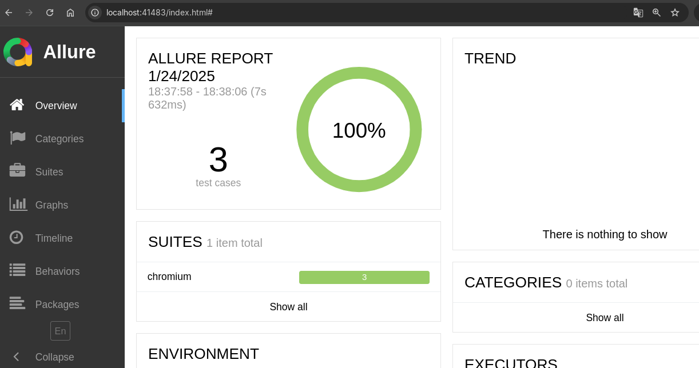

# Executando os Testes

Para facilitar a execução dos testes foi criado scripts no [package.json](package.json) para facilitar a execução dos testes.

## 1. Executar Todos os Testes

```bash
npm run all
```

## 2. Executar um Teste Login

```bash
npm run login
```

## 3. Executar um Teste Account

```bash
npm run account
```

# Visualizando relatórios com Allure

Para visualizar os relatórios gerados com Allure, execute o seguinte comando:

```bash
allure serve
```

Ao executar o comando irá aparecer a seguinte mensagem:



Para visualizar os relatórios, abra o navegador e acesse o endereço que irá aparecer e voce visualizará os dados.

