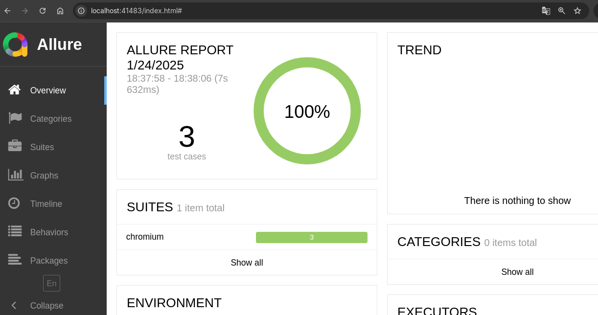

# Executando no Docker

Executar os testes dentro de um contêiner Docker garante consistência entre diferentes ambientes e facilita a integração com pipelines de CI/CD.

##  1. Construir a Imagem Docker
   No diretório raiz do projeto, construa a imagem Docker usando o Dockerfile:

```bash
docker build -t testafofo-playwright .
```

Explicação dos Parâmetros:

    -t testafofo-playwright: Dá um nome à imagem (no caso, testafofo-playwright).
    .: Indica que o Dockerfile está no diretório atual.

##  2. Executar os Testes no Contêiner
   Use o comando docker run para executar os testes dentro do contêiner:

```bash
docker run --rm -v $(pwd)/allure-results:/app/allure-results:rw testafofo-playwright npm run all
```

Explicação dos Parâmetros:

    --rm: Remove o contêiner após a execução para evitar acumular contêineres inativos.
    -v $(pwd)/allure-results:/app/allure-results:rw: Mapeia o diretório allure-results do host para o diretório allure-results dentro do contêiner. O modo rw (leitura e escrita) permite que os relatórios sejam salvos no seu sistema de arquivos local.
    testafofo-playwright: Nome da imagem Docker que você construiu.
    npm run all: Comando para executar os testes (ajuste conforme seu package.json).

## 3. Executar Testes Específicos ou com Parâmetros

Se você quiser passar parâmetros para o Playwright (como executar testes específicos ou definir o navegador), basta adicionar os parâmetros ao final do comando. 

### Executar testes com a tag "Login":

```bash
docker run --rm -v $(pwd)/allure-results:/app/allure-results:rw testafofo-playwright npm run login
```

## Visualizando relatórios com Allure

Para visualizar os relatórios gerados com Allure, execute o seguinte comando:

```bash
allure serve
```

Ao executar o comando irá aparecer a seguinte mensagem:


Para visualizar os relatórios, abra o navegador e acesse o endereço que irá aparecer e voce visualizará os dados.

